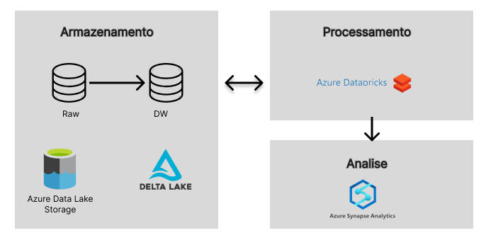

# Criação de Datawarehouse usando Azure Databricks e Azure Synapse Analytics

## Introdução

Scripts feitos no Databricks para criação de um Datawarehouse. Assim como o projeto "DataWarehouse-Eccomerce-MySQL" (presente nesse GitHub), os dados vem do Kaggle e são de um e-ccommerce (https://www.kaggle.com/datasets/olistbr/brazilian-ecommerce?resource=download).

Criado em duas versões. Na primeira versão, os dados em arquivos .csv são puxados pelo Databricks Community que organiza os dados em um datawarehouse que segue o esquema star-schema. Esses dados são salvos e exportados em arquivos .csv.

Na segunda versão, os dados em arquivos .csv são salvos no Azure Data Lake Storage Gen2. O Azure Databricks puxa esses dados e os organiza em um datawarehouse que segue o esquema star-schema. Os dados são salvos em tabelas delta que ficam armazenadas no Azure Data Lake Storage Gen2. Após isso, os dados do data warehouse pronto são salvos no Azure Synapse Analytics.

**Tecnologias Usadas**: Databricks Community, Azure Data Lake Storage Gen2, Azure Databricks, Azure Synapse Analytics

## Preparação e Execução do Projeto

### Dados

Os dados vem do seguinte repositório do Kaggle: https://www.kaggle.com/datasets/olistbr/brazilian-ecommerce?resource=download. Contém dados de um eccommerce.

### Estrutura do Datawarehouse

A estrutura do datawarehouse é bem semelhante ao projeto "DataWarehouse-Eccomerce-MySQL" (presente nesse GitHub). Existem poucas diferenças, sendo que algumas delas são: não existe mais a dimensão de tipo de pagamento e foram adicionadas algumas colunas novas que podem facilitar algumas analises.

Assim como no projeto "DataWarehouse-Eccomerce-MySQL", a estrutura foi dividida em tabelas de dimensão e fato. As tabelas de dimensão são dw_time (dimensão de tempo), dw_products, dw_sellers, dw_customers, dw_orders. As tabelas fato são dw_payments, dw_reviews e dw_itens. Além disso, as tabelas usam surrogate keys (números inteiros que vão de 1 até n) como chave primária.

Há também tabelas de dimensão que se comportam como slowly changing dimension. Isso significa que se houver alguma mudança, em qualquer linha de dados dessas tabelas, o datawarehouse ainda manterá os dados antigos, mas com uma coluna "FIM" preenchida, que representa o horário da mudança. Os dados novos serão salvos em uma nova linha que possuirá o mesmo "ID", mas diferentes surrogate keys.

### Estrutura do Projeto

#### Databricks Community

Nessa versão do projeto, os dados são puxados dos arquivos .csv para o Databricks. Após isso, os dados são processados e organizados em um datawarehouse. Após isso, os dados são exportados em arquivos .csv.

#### Azure Databricks

Nessa versão do projeto, os dados em arquivos .csv são salvos no Azure Data Lake Storage Gen2. O Azure Databricks puxa esses dados e os organiza em um datawarehouse que segue o esquema star-schema. Os dados são salvos em tabelas delta que ficam armazenadas no Azure Data Lake Storage Gen2. Após isso, os dados do data warehouse pronto são salvos no Azure Synapse Analytiscs.

O diagrama abaixo mostra a arquitetura:

### Execução do projeto

Em ambas as versões, basta executar os scripts do Databricks. Porém, antes de executa-lo é necessário realizar algumas preparações.

Para a primeira versão, salve os arquivos de dados no DBFS do Databricks e fique atento aos nomes das pastas.

Para a segunda versão, esse projeto seguiu os tutoriais presentes nos seguintes videos: https://www.youtube.com/watch?v=0uD2fqgdeQM e https://www.youtube.com/watch?v=tvaNX231sXQ&t=1s. Além disso, para criar os segredos, esse projeto seguiu o seguinte tutorial: https://www.youtube.com/watch?v=tvaNX231sXQ&t=1s.
